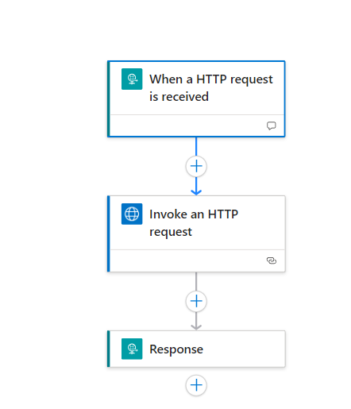
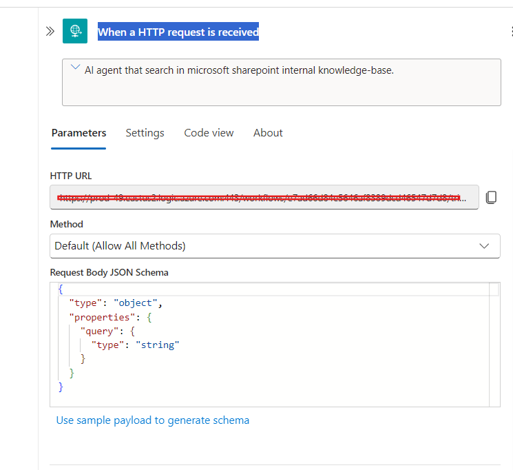
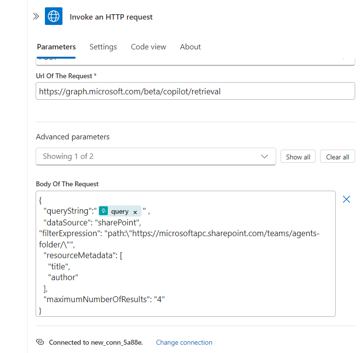
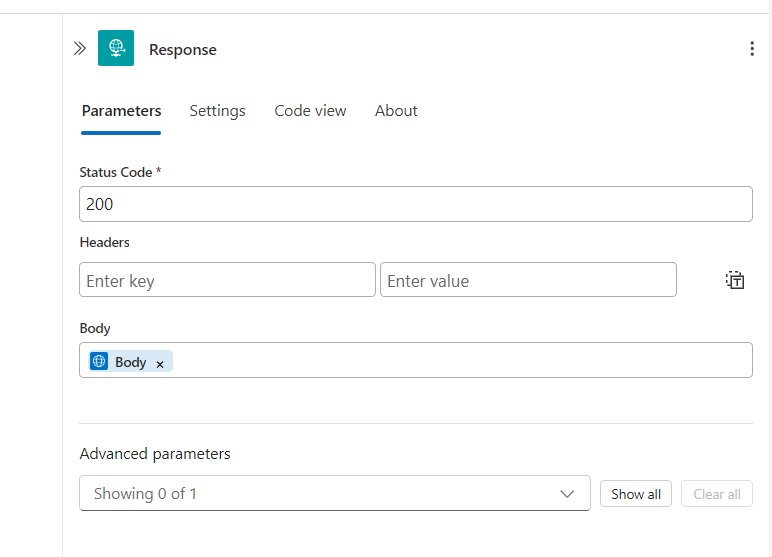
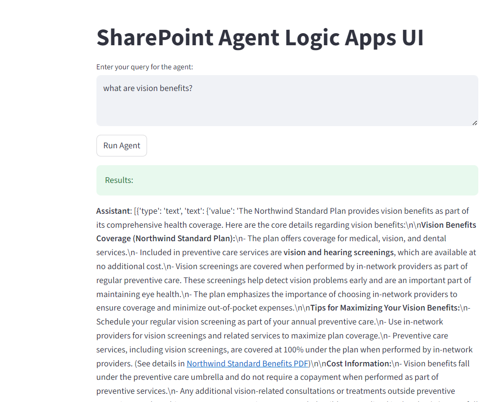

# Agents LogicApps SharePoint

This project demonstrates how to use Azure AI Agents with Logic Apps to retrieve and summarize SharePoint content. It supports both standalone script execution and a web interface via Streamlit.

## Prerequisites
- Python 3.11+
- Azure Subscription
- Logic App with HTTP trigger configured
- SharePoint access
- Required Azure resources (AI Project, Logic App, etc.)

## LogicApps Setup



1. When a HTTP request is received



2. Invoke Http Request



For connection, use Microsoft Entra Id (Pre-Authorized) which has Copilot License for authentication.
Enter Base URL and Application URL as ```https://graph.microsoft.com```

For more info to retrieve data from SharePoint site using M365 Copilot API, refer to https://learn.microsoft.com/en-us/microsoft-365-copilot/extensibility/api/ai-services/retrieval/copilotroot-retrieval#example-4-retrieve-data-from-a-specific-sharepoint-site

3. Response



## Code Setup
1. **Clone the repository**
   ```cmd
   git clone https://github.com/hifaz1012/agents-logicapps-sharepoint.git
   cd agents-logicapps-sharepoint
   ```
2. **Create and activate a virtual environment (venv)**
   ```cmd
   python -m venv test_env
   test_env\Scripts\activate
   ```
3. **Install dependencies**
   ```cmd
   pip install -r requirements.txt
   ```
4. **Configure environment variables**
   - Create a `.env` file in the project root with the following keys:
     ```env
     PROJECT_ENDPOINT=<your-azure-ai-project-endpoint>
     SUBSCRIPTION_ID=<your-azure-subscription-id>
     RESOURCE_GROUP=<your-resource-group>
     LOGIC_APP_NAME=<your-logic-app-name>
     TRIGGER_NAME="When_a_HTTP_request_is_received"
     MODEL_DEPLOYMENT_NAME=<your-model-deployment-name>
     ```

## Running the App

### Standalone Mode
Run the main agent script to execute a SharePoint query and print results to the console:
```cmd
python agents-sharepoint-logicapps-standalone.py
```

### Web Mode (Streamlit)

Launch the FAST API:
```cmd
uvicorn main:app --reload
```

Launch the Streamlit web interface:
```cmd
streamlit run streamlit_app.py
```

## UI Screenshot



## Files
- `agents-sharepoint-logicapps-standalone.py`: Standalone script for agent execution
- `streamlit_app.py`: Streamlit web app
- `requirements.txt`: Python dependencies
- `user_functions.py`, `user_logic_apps.py`: Utility modules


